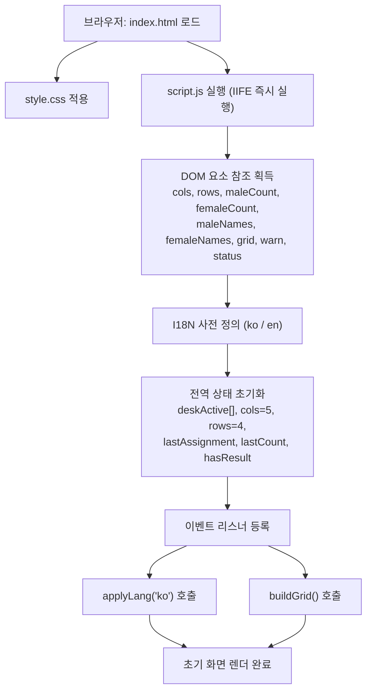
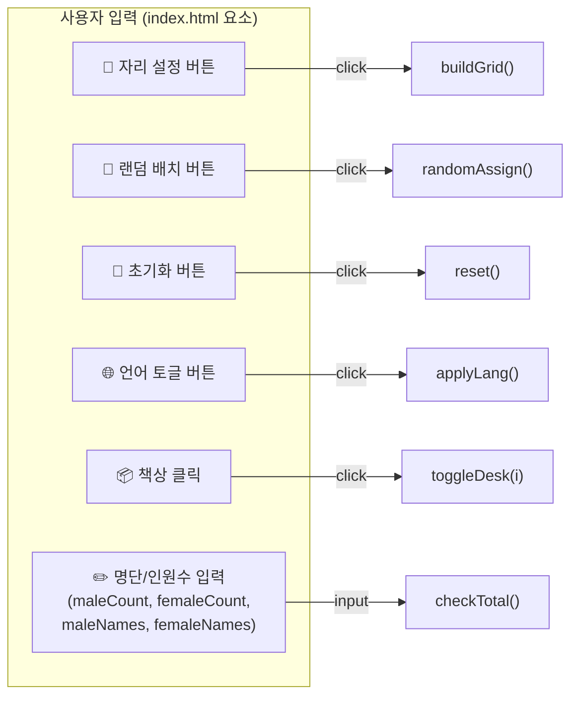
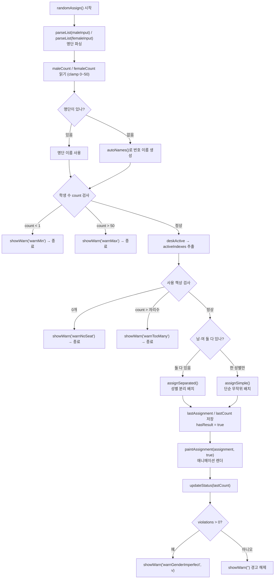
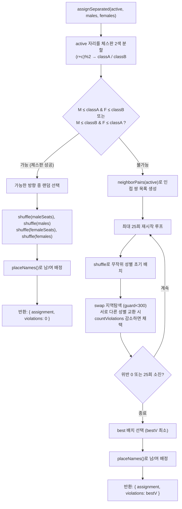
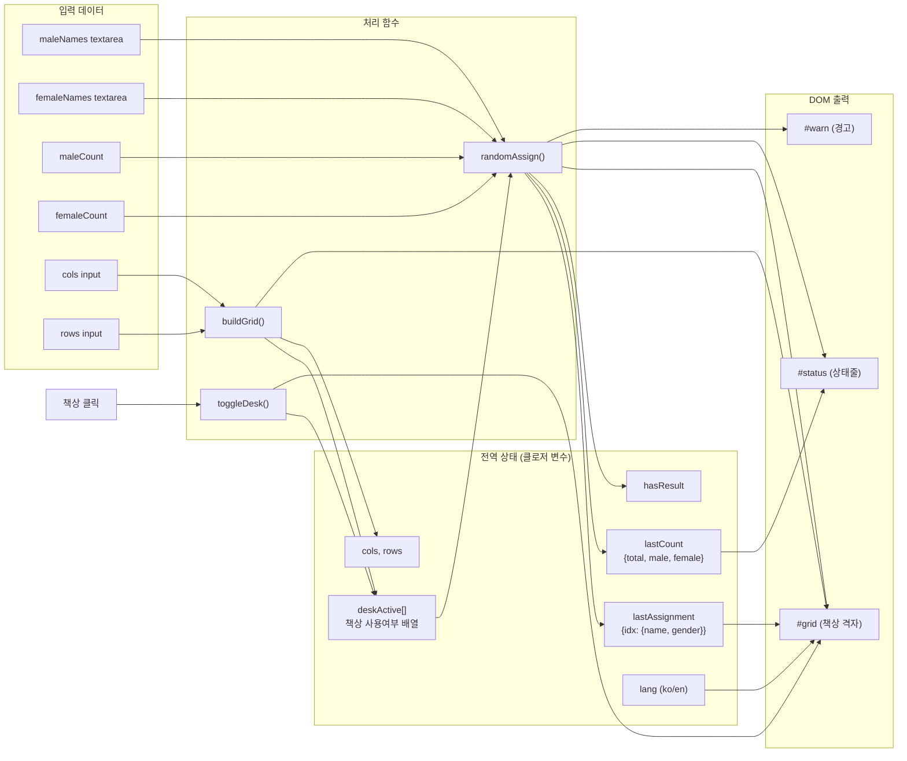
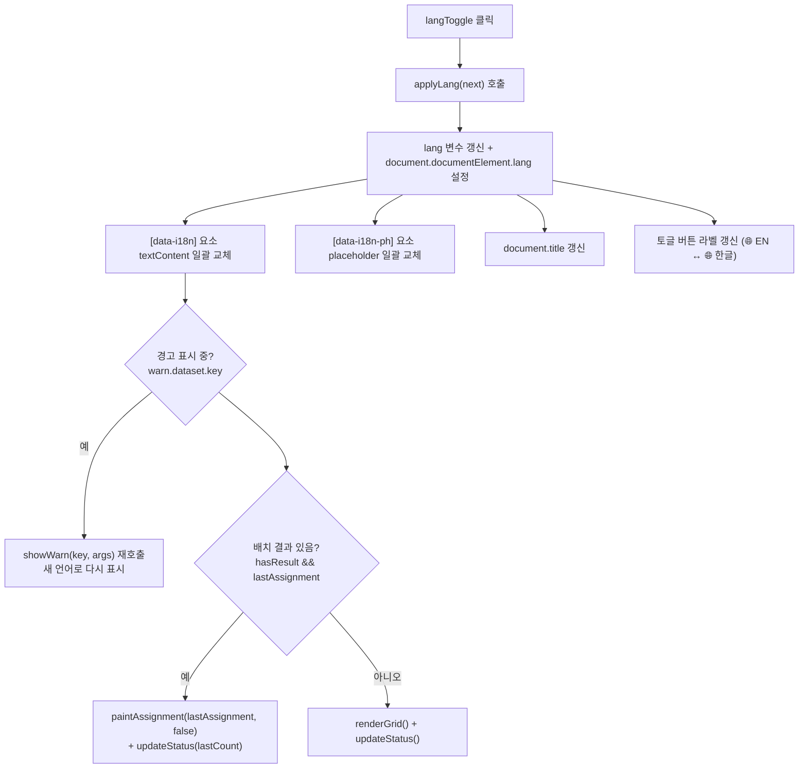

# 🗺️ 교실 자리배치 앱 — 전체 코드 흐름도

이 문서는 프로젝트의 모든 파일과 함수, 그리고 함수 간 호출 관계 및 데이터 흐름을 mermaid 다이어그램으로 정리한 것입니다.

## 📁 파일 구성

| 파일 | 역할 |
|------|------|
| `index.html` | 화면 구조(DOM), 요소 배치, script/style 로드 |
| `style.css` | 스타일·레이아웃·책상/문/칠판 그래픽·애니메이션·반응형 |
| `script.js` | 전체 로직 (IIFE 하나로 캡슐화) |
| `samples/학생명단_샘플_40명.txt` | 한글 샘플 명단 데이터 (이름만) |
| `samples/students_sample_en_40.txt` | 영어 샘플 명단 데이터 (이름만) |
| `samples/테스트_학생명단_30명.xlsx` | 엑셀 테스트 명단 (번호·이름·성별) |

> ℹ️ 이 흐름도는 React로 바꾸기 전(바닐라 JS `script.js` 한 파일) 버전 기준이며, 명단 파일 불러오기·인쇄·엑셀 저장 기능도 빠져 있습니다. 현재 구조는 README의 "폴더 구성"을 참고하세요.

---

## 1. 파일 로드 & 초기화 흐름

---

## 2. 이벤트 → 진입 함수 매핑

---

## 3. 전체 함수 호출 관계도 (핵심)

```mermaid
flowchart TD
    %% 진입점
    subgraph ENTRY["진입 함수 (이벤트 핸들러)"]
        buildGrid["buildGrid()<br/>격자 생성"]
        randomAssign["randomAssign()<br/>랜덤 배치 실행"]
        reset["reset()<br/>배치만 초기화"]
        applyLang["applyLang(next)<br/>언어 전환"]
        toggleDesk["toggleDesk(i)<br/>책상 사용/해제"]
        checkTotal["checkTotal()<br/>실시간 인원 검사"]
    end

    %% 렌더/상태
    subgraph RENDER["렌더 & 상태"]
        renderGrid["renderGrid()<br/>빈 격자 그리기"]
        paintAssignment["paintAssignment(assignment, animate)<br/>배치결과 그리기"]
        updateStatus["updateStatus(countObj)<br/>상태 표시줄 갱신"]
        showWarn["showWarn(key, ...args)<br/>경고 메시지 표시"]
        clearResult["clearResult()<br/>배치결과 리셋"]
    end

    %% 배치 알고리즘
    subgraph ALGO["배치 알고리즘"]
        assignSeparated["assignSeparated(active, males, females)<br/>성별 분리 배치"]
        assignSimple["assignSimple(active, students)<br/>단순 무작위 배치"]
        neighborPairs["neighborPairs(active)<br/>인접 쌍 계산"]
        countViolations["countViolations(map, pairs)<br/>같은 성별 인접 수"]
        placeNames["placeNames(assignment, seats, names, gender)<br/>이름→자리 배정"]
        shuffle["shuffle(arr)<br/>Fisher-Yates"]
    end

    %% 유틸
    subgraph UTIL["유틸리티"]
        parseList["parseList(el)<br/>textarea→이름 배열"]
        autoNames["autoNames(gender, n)<br/>자동 이름 생성"]
        clamp["clamp(v, min, max)"]
        escapeHtml["escapeHtml(s)"]
        t["t()<br/>현재 언어 사전 반환"]
    end

    %% buildGrid 호출
    buildGrid --> clamp
    buildGrid --> clearResult
    buildGrid --> renderGrid
    buildGrid --> updateStatus
    buildGrid --> showWarn

    %% toggleDesk 호출
    toggleDesk --> clearResult
    toggleDesk --> renderGrid
    toggleDesk --> updateStatus

    %% reset 호출
    reset --> clearResult
    reset --> renderGrid
    reset --> updateStatus
    reset --> showWarn

    %% renderGrid 호출
    renderGrid --> toggleDesk
    renderGrid --> t

    %% checkTotal 호출
    checkTotal --> parseList
    checkTotal --> showWarn

    %% randomAssign 호출 (핵심)
    randomAssign --> parseList
    randomAssign --> clamp
    randomAssign --> autoNames
    randomAssign --> showWarn
    randomAssign --> assignSeparated
    randomAssign --> assignSimple
    randomAssign --> paintAssignment
    randomAssign --> updateStatus

    %% assignSeparated 호출
    assignSeparated --> shuffle
    assignSeparated --> placeNames
    assignSeparated --> neighborPairs
    assignSeparated --> countViolations

    %% assignSimple 호출
    assignSimple --> shuffle

    %% paintAssignment 호출
    paintAssignment --> renderGrid
    paintAssignment --> escapeHtml
    paintAssignment --> t

    %% updateStatus / showWarn 은 t() 사용
    updateStatus --> t
    showWarn --> t

    %% applyLang 호출
    applyLang --> t
    applyLang --> showWarn
    applyLang --> paintAssignment
    applyLang --> updateStatus
    applyLang --> renderGrid
```

---

## 4. 랜덤 배치 상세 로직 (randomAssign 내부 분기)

---

## 5. 성별 분리 알고리즘 (assignSeparated 내부)

---

## 6. 데이터 흐름 (State ↔ 함수 ↔ DOM)

---

## 7. 언어 전환 데이터 흐름 (applyLang)

---

## 8. 함수 요약표

| 함수 | 역할 | 호출하는 함수 |
|------|------|--------------|
| `buildGrid()` | 격자 새로 생성, deskActive 초기화 | clamp, clearResult, renderGrid, updateStatus, showWarn |
| `renderGrid()` | 빈 책상 격자 DOM 렌더 | t, (책상에 toggleDesk 바인딩) |
| `toggleDesk(i)` | 책상 사용/빈자리 전환 | clearResult, renderGrid, updateStatus |
| `randomAssign()` | 랜덤 배치 총괄 | parseList, clamp, autoNames, showWarn, assignSeparated, assignSimple, paintAssignment, updateStatus |
| `assignSeparated()` | 같은 성별 비인접 배치 | shuffle, placeNames, neighborPairs, countViolations |
| `assignSimple()` | 단일 성별 무작위 배치 | shuffle |
| `neighborPairs()` | 인접(우/하) 자리쌍 목록 | — |
| `countViolations()` | 같은 성별 인접 쌍 수 계산 | — |
| `placeNames()` | 이름 배열을 자리에 배정 | — |
| `shuffle()` | Fisher-Yates 셔플 | — |
| `paintAssignment()` | 배치 결과 DOM 렌더 + 애니메이션 | renderGrid, escapeHtml, t |
| `updateStatus()` | 상태 표시줄 갱신 | t |
| `showWarn()` | 경고 메시지 표시/해제 | t |
| `clearResult()` | 배치 결과 상태 초기화 | — |
| `reset()` | 배치만 초기화(격자 유지) | clearResult, renderGrid, updateStatus, showWarn |
| `applyLang()` | 언어 전환 + 재렌더 | t, showWarn, paintAssignment, updateStatus, renderGrid |
| `checkTotal()` | 입력 시 실시간 인원 검사 | parseList, showWarn |
| `parseList()` | textarea → 이름 배열 | — |
| `autoNames()` | 번호 이름 자동 생성 | — |
| `clamp()` | 값 범위 제한 | — |
| `escapeHtml()` | XSS 방지 이스케이프 | — |
| `t()` | 현재 언어 사전 반환 | — |
